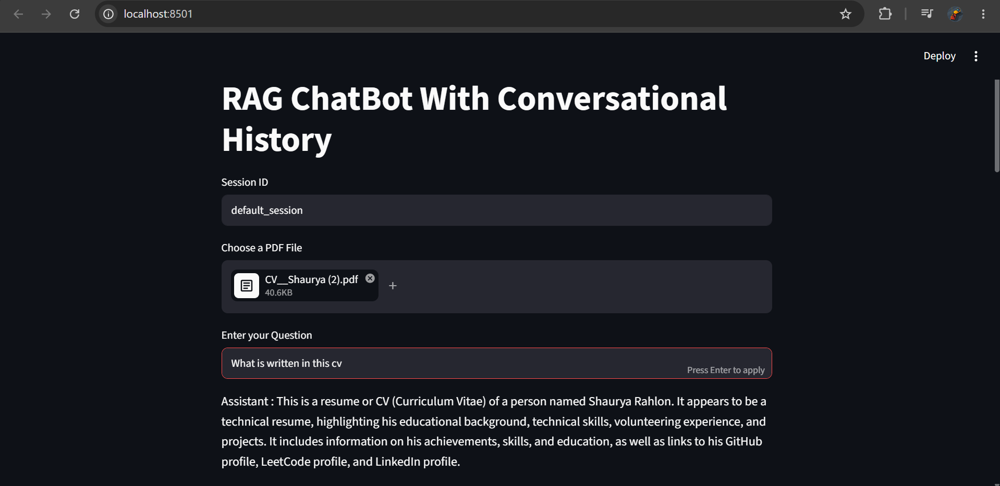

# 📄 Conversational RAG Chatbot

A Conversational Retrieval-Augmented Generation (RAG) chatbot that allows users to upload one or multiple PDF documents and ask questions in natural language. The chatbot maintains conversation history, reformulates follow-up questions intelligently, and retrieves the most relevant document chunks before generating accurate responses using Groq's Llama 3.1 model.

---

## 🚀 Features

- 📚 Upload multiple PDF documents
- 💬 Conversational question answering
- 🧠 History-aware retrieval using LangChain
- 🔍 Semantic search with Chroma Vector Database
- 🤖 Powered by Groq Llama 3.1
- 📖 Hugging Face BGE Embeddings
- ⚡ Fast Streamlit interface
- 🔄 Multi-session chat history support
- 📄 Automatic document chunking and indexing

---

## 🛠️ Tech Stack

### Frontend
- Streamlit

### Backend
- Python
- LangChain

### LLM
- Groq
- Llama-3.1-8B-Instant

### Vector Database
- ChromaDB

### Embedding Model
- BAAI/bge-base-en-v1.5

### Libraries
- LangChain
- LangChain Groq
- LangChain Chroma
- LangChain HuggingFace
- PyPDFLoader
- RecursiveCharacterTextSplitter
- python-dotenv

---

## 📂 Project Structure

```
Conversational-RAG-Chatbot/
│
├── app.py
├── requirements.txt
├── .env
├── README.md
└── screenshots/
```

---

## ⚙️ Installation

### Clone the repository

```bash
git clone https://github.com/Yash212006/RAG-From-PDFs-ChatBot.git
```

```bash
cd Conversational-RAG-Chatbot
```

### Create a virtual environment

Windows

```bash
python -m venv venv
venv\Scripts\activate
```

Linux / Mac

```bash
python3 -m venv venv
source venv/bin/activate
```

### Install dependencies

```bash
pip install -r requirements.txt
```

---

## 🔑 Environment Variables

Create a `.env` file in the project root.

```env
HF_TOKEN=your_huggingface_token
GROQ_API_KEY2=your_groq_api_key
```

---

## ▶️ Run the Application

```bash
streamlit run app.py
```

---

## 📖 How It Works

1. Upload one or multiple PDF files.
2. Documents are loaded using PyPDFLoader.
3. PDFs are split into smaller chunks.
4. Chunks are converted into embeddings using BGE Embeddings.
5. Embeddings are stored in Chroma Vector Database.
6. User asks a question.
7. LangChain reformulates follow-up questions using chat history.
8. Relevant document chunks are retrieved.
9. Groq Llama 3.1 generates a context-aware answer.
10. Conversation history is preserved for each session.

---

## 🧠 RAG Pipeline

```
User Uploads PDFs
        │
        ▼
PyPDFLoader
        │
        ▼
Text Splitter
        │
        ▼
BGE Embeddings
        │
        ▼
Chroma Vector Store
        │
        ▼
History Aware Retriever
        │
        ▼
Relevant Context
        │
        ▼
Groq Llama 3.1
        │
        ▼
Final Answer
```
---
## 📸 Demo



---


## 🎯 Future Improvements

- Persistent vector database
- Support for DOCX and TXT files
- Source citations with page numbers
- Streaming responses
- Authentication
- Cloud deployment
- Multi-user support
- Conversation export
- OCR support for scanned PDFs

---

## 🤝 Contributing

Contributions are welcome!

1. Fork the repository
2. Create a new branch

```bash
git checkout -b feature-name
```

3. Commit your changes

```bash
git commit -m "Add new feature"
```

4. Push to the branch

```bash
git push origin feature-name
```

5. Open a Pull Request

---

## 📄 License

This project is licensed under the MIT License.

---

## 👨‍💻 Author

**Yash Saraswat**

If you found this project helpful, consider giving it a ⭐ on GitHub.
